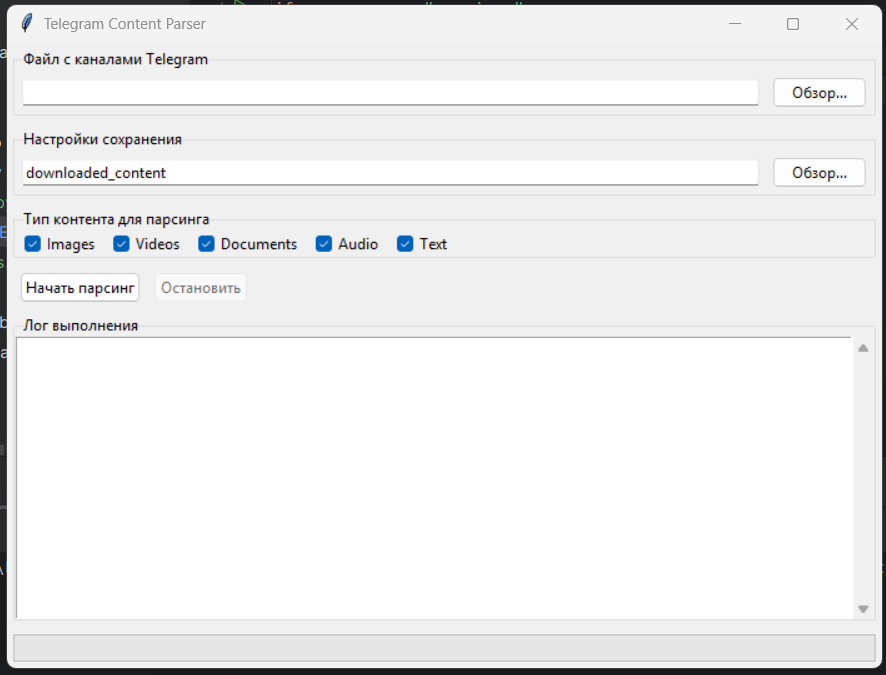

# Парсер контента Telegram

Графическое приложение для скачивания различных типов контента (изображений, видео, документов, аудио и текста) из каналов Telegram.

 *(Заметка: добавьте реальный скриншот позже)*

## Возможности

- **Парсинг разных типов контента**:
  - Изображения (JPG, PNG, GIF, BMP, WEBP)
  - Видео (MP4, MOV, AVI, MKV, WEBM)
  - Документы (PDF, DOC, DOCX, TXT, XLS, XLSX)
  - Аудио (MP3, WAV, OGG, M4A)
  - Текст (извлечение текстового содержимого)

- **Удобный интерфейс**:
  - Загрузка списка каналов из текстового файла
  - Выбор конкретных типов контента для скачивания
  - Настройка папки для сохранения
  - Отслеживание прогресса в реальном времени
  - Подробный лог выполнения

- **Эффективная организация**:
  - Создает отдельные папки для каждого канала
  - Сортирует контент по типам в подпапках
  - Интеллектуальная обработка дубликатов файлов

## Требования

- Python 3.7+
- Необходимые пакеты:
  - requests
  - tkinter (обычно входит в состав Python)

## Установка

1. Клонируйте репозиторий:
   ```bash
   git clone https://github.com/ваш_username/telegram-content-parser.git
   cd telegram-content-parser